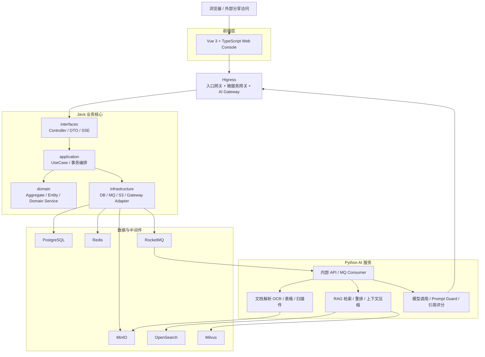
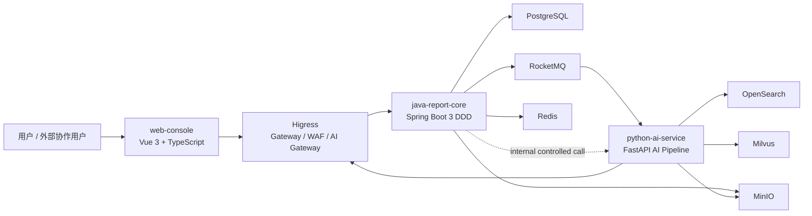
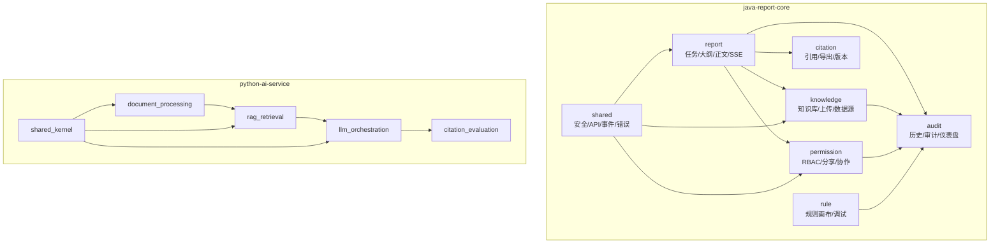

# 智能报告生成系统架构设计

> Skill：S5 architecture.design  
> 约束：所有架构图必须使用 Mermaid；后端代码骨架遵循 DDD 分层；文档集中在 `docs/skill-chain/`。

## 1. 架构目标

系统采用 Java DDD 模块化单体业务核心 + Python AI 服务 + Higress 统一网关 + RocketMQ 异步任务 + PostgreSQL/Redis/OpenSearch/Milvus/MinIO 基础设施。

核心目标：

- 让报告生成、知识入库、RAG、导出、权限协作和审计形成闭环。
- 外部业务 API 统一进入 Java 业务核心，避免 Python AI 服务绕过任务状态、RBAC 和审计。
- AI 相关能力与业务事务解耦，通过 RocketMQ 和受控内部调用协作。
- 本地开发通过 Docker Compose 复用或最小化部署依赖。

## 2. 分层架构图

## 3. C4 Container 图

## 4. 组件图

## 5. 关键通信

| 通信 | 协议 | 说明 |
| --- | --- | --- |
| 前端到 Higress | HTTPS / SSE | 浏览器和外部分享统一进入网关 |
| Higress 到 Java | HTTP REST / SSE | Java 是外部业务 API 归口 |
| Java 到 Python | RocketMQ 优先，内部 REST 受控补充 | 长耗时 AI 流程解耦 |
| Python 到模型供应商 | HTTPS via Higress AI Gateway | 便于 Prompt 安全、Token 限流、多模型路由 |
| Java/Python 到存储 | JDBC / S3 / HTTP / SDK | 主数据、对象、全文、向量 |

## 6. ADR 摘要

| ADR | 决策 | 理由 |
| --- | --- | --- |
| ADR-001 | Java DDD 模块化单体 + Python AI 服务 | 保持业务一致性，同时隔离 AI 技术栈 |
| ADR-002 | Higress | 覆盖入口、微服务网关、AI Gateway、安全和可观测 |
| ADR-003 | PostgreSQL 作为主数据 | 适合业务数据、审计、JSON 扩展和复杂查询 |
| ADR-004 | RocketMQ 异步任务 | 支撑生成、解析、导出、同步任务的重试和补偿 |
| ADR-005 | Python AI 服务可直接消费 RocketMQ | 避免 AI 执行链与 Java 服务强耦合 |
| ADR-006 | 线上 GPT 优先，保留多模型路由 | 满足当前使用约束并保留演进能力 |

## 7. 范围护栏

当前阶段不引入多租户、私有化部署、高可用、灾备或报告人工审核发布流程。历史样例中的“审核”只视为样例文本，不映射为发布审批能力。
