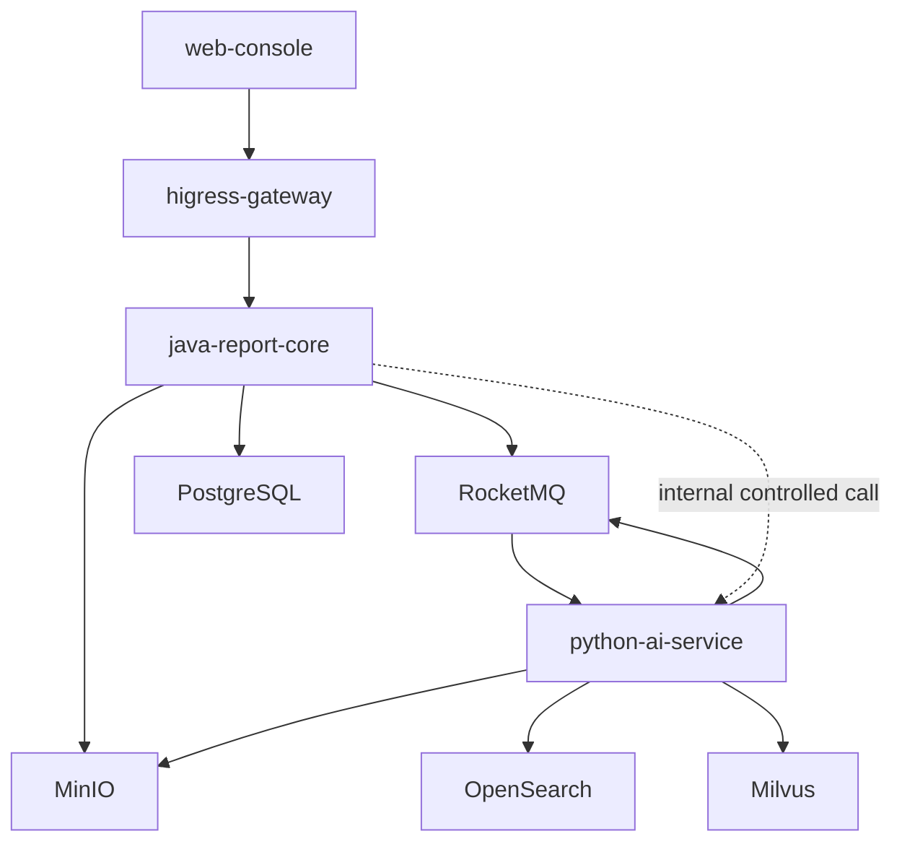

# 智能报告生成系统模块设计

> Skill：S7 module.design  
> 状态：基于 S1-S6 与 OpenSpec baseline 重建为可读版本。  
> 约束：Java 后端按 DDD 分层；Python AI 服务可独立消费 RocketMQ；文档集中在 `docs/skill-chain/`。

## 1. 模块总览

| 模块 | 部署单元 | 类型 | 核心职责 |
| --- | --- | --- | --- |
| `web-console` | 前端应用 | UI | Vue 3 控制台、报告生成、知识库、规则、权限、审计、分享访问 |
| `java-report-core` | Java 业务核心 | 模块化单体 | 业务 API、RBAC、审计、报告、知识库、规则、协作、导出 |
| `python-ai-service` | Python AI 服务 | 独立服务 | 文档解析、RAG、Embedding、模型调用、引用评分 |
| `higress-gateway` | 网关基础设施 | 独立组件 | 外部入口、WAF、OIDC/JWT 前置、AI Gateway、限流、观测 |
| `postgres` | 数据基础设施 | 依赖 | 主数据、审计、任务、配置 |
| `rocketmq` | 消息基础设施 | 依赖 | 长耗时任务事件 |
| `minio` | 对象存储 | 依赖 | 上传原文、解析产物、导出文件 |
| `opensearch` | 全文检索 | 依赖 | 知识全文索引 |
| `milvus` | 向量检索 | 依赖 | Embedding 召回 |

## 2. Java DDD 模块

| 包 | 分层 | 职责 |
| --- | --- | --- |
| `report` | `interfaces/application/domain/infrastructure` | 报告任务、模板生成、大纲确认、SSE、正文保存 |
| `citation` | `interfaces/application/domain/infrastructure` | 引用来源、引用锚点、导出、版本回滚 |
| `knowledge` | `interfaces/application/domain/infrastructure` | 知识库、条目、上传、数据源、解析状态 |
| `permission` | `interfaces/application/domain/infrastructure` | 当前用户、RBAC、用户管理、分享、批注、任务 |
| `rule` | `interfaces/application/domain/infrastructure` | 规则节点、连线、版本、调试日志 |
| `audit` | `interfaces/application/domain/infrastructure` | 操作日志、模型审计、历史、Dashboard 聚合 |
| `shared` | `api/error/event/security` | 统一响应、错误码、事件发布、安全上下文 |

Java 业务核心必须作为外部业务 API 归口。Python `/api/v1/chat` 不得作为公开报告生成入口绕过 Java。

## 3. Python AI 模块

| 包 | 职责 | 输入 | 输出 |
| --- | --- | --- | --- |
| `document_processing` | OCR、表格识别、扫描件处理、分块 | `document.parse.requested` | 解析结果、片段、索引事件 |
| `rag_retrieval` | OpenSearch/Milvus 混合检索、重排、上下文压缩 | 报告任务上下文、知识范围 | 上下文片段、引用候选 |
| `llm_orchestration` | Prompt 组装、线上 GPT 调用、多模型路由预留 | 大纲/正文生成请求 | 流式文本、模型调用审计 |
| `citation_evaluation` | 证据评分和引用质量评估 | 引用候选与正文段落 | 评分和质量说明 |
| `shared_kernel` | 错误、安全、SSE schema、配置 | 通用 | 通用能力 |

Python AI 服务允许直接消费 RocketMQ，不必经 Java 同步转发。

## 4. 模块关系图



## 5. 服务拆分判断

| 候选 | 当前结论 | 理由 |
| --- | --- | --- |
| 报告生成 | Java 模块 | 强依赖权限、审计、版本和业务事务 |
| 导出执行 | Java 模块 + Spring TaskExecutor + RocketMQ | 当前无需独立服务；导出元数据归 Java |
| 知识库 | Java 模块 | 元数据、权限、数据源配置归业务核心 |
| 文档解析 | Python AI 服务内模块 | OCR/解析技术栈独立，可后续按资源压力拆子服务 |
| RAG 检索 | Python AI 服务内模块 | 依赖 AI 技术栈和索引；QPS 独立增长后再拆 |
| LLM 编排 | Python AI 服务内模块 + Higress AI Gateway | 模型调用策略与 AI 管线一致 |
| 权限协作 | Java 模块 | 与报告资源授权强耦合 |
| 审计 | Java 模块 | 查询权限依赖业务身份；存储后续可独立优化 |
| 网关 | Higress 独立组件 | 不持有业务主数据 |

## 6. OpenSpec 对应

| Capability | 模块 |
| --- | --- |
| `report-generation` | Java `report` + Python `rag_retrieval/llm_orchestration` |
| `report-citation-export-version` | Java `citation` + Python `citation_evaluation` + MinIO |
| `knowledge-base-ingestion` | Java `knowledge` + Python `document_processing` + OpenSearch/Milvus |
| `rule-engine` | Java `rule` + 前端规则页面 |
| `permission-collaboration` | Java `permission` + 前端权限/分享/协作页面 |
| `audit-history-dashboard` | Java `audit` + 前端审计/工作台页面 |
| `scope-guardrails` | 全局约束 |

## 7. 代码骨架约束

Java 每个业务模块应保持：

```text
<bounded-context>/
  interfaces/
  application/
  domain/
  infrastructure/
```

禁止把业务规则直接写进 Controller；权限、状态机、审计、事件发布应在 application/domain 层完成。
