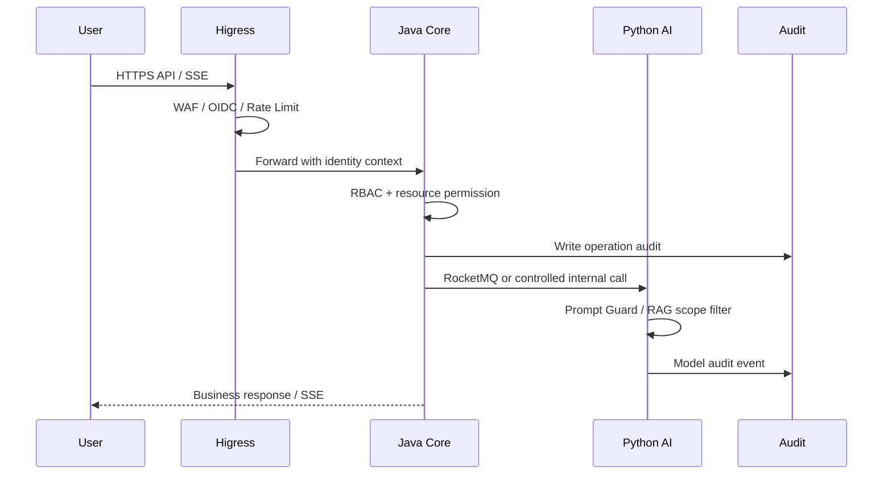

# 智能报告生成系统安全设计

> Skill: S08 security.design  
> 范围：认证、授权、分享、文件、模型调用、审计、网关与本地开发安全边界。

## 1. 安全原则

| 原则 | 说明 |
| --- | --- |
| Java 业务核心归口 | 外部业务 API 统一进入 Java，确保 RBAC、任务状态和审计闭环 |
| Higress 前置治理 | Higress 承担入口路由、WAF、JWT/OIDC 前置、限流、AI Gateway 和可观测 |
| Python 内部执行面 | Python AI 服务只作为内部或受控执行面，不公开绕过 Java 的业务入口 |
| 最小权限 | 用户、分享、数据源、导出、模型审计均按最小权限授权 |
| 审计优先 | 关键操作、模型调用、分享访问、导出下载必须留痕 |
| 本地隔离 | 本地开发不得连接生产数据库或生产模型密钥 |

## 2. 认证与授权

| 场景 | 设计 |
| --- | --- |
| 登录入口 | 生产由 Higress/OIDC 承担，Java 提供 `/api/v1/auth/me` 查询当前用户 |
| API 鉴权 | Java Spring Security 校验 JWT 和权限项 |
| JWT 算法边界 | 本地默认 `HS256 + JWT_SECRET`；生产 `RS256` 必须配置 `OIDC_JWKS_URL + OIDC_ISSUER + OIDC_AUDIENCE`，任一缺失或 token `iss/aud` 不匹配必须 fail closed；JWKS 按 `kid` 缓存并在 kid 缺失时刷新 |
| Higress OIDC smoke | Local gateway smoke can opt into `RS256` `/api/v1/auth/me` probes for accepted, wrong-issuer, and wrong-audience tokens without changing default `HS256` local development behavior. |
| Higress WAF smoke | Default local smoke verifies Java fallback for malformed attack-shaped input; `HIGRESS_WAF_BLOCKING_COVERAGE=true` enables an explicit SQLi/XSS/path-traversal/prompt-injection blocking contract that must return `403`, `406`, or `429` after a real WAF policy is installed. |
| RBAC | 当前包含管理员、高级分析师、分析师、查看者，并保留扩展 |
| 分享访问 | 分享 Token + 可选密码 + 有效期 + 撤销状态 + 报告授权范围 |
| 前端控制 | 前端隐藏按钮只作为体验优化，后端必须强校验 |

## 3. 接口安全矩阵

| API | 认证 | 权限 | 资源校验 |
| --- | --- | --- | --- |
| `/api/v1/reports/generation-tasks/**` | JWT | `report:create` | 创建人、任务状态 |
| `/api/v1/reports/**` 查看 | JWT 或有效分享凭证 | `report:read` | 创建人、授权用户、分享范围 |
| `/api/v1/reports/{reportId}/exports` | JWT | `report:export` | 报告访问权、模板状态、版本状态 |
| `/api/v1/documents/upload` | JWT | `knowledge:upload` | 文件类型、大小、知识库写权限 |
| `/api/v1/knowledge-bases/**` | JWT | `knowledge:read/write/manage` | 知识库访问范围 |
| `/api/v1/data-sources/**` | JWT | `datasource:manage` | 数据源归属、连接测试结果 |
| `/api/v1/rules/**` | JWT | `rule:manage/debug` | 规则版本、节点契约 |
| `/api/v1/users/**` | JWT | `user:manage` | 禁止普通用户管理账号 |
| `/api/v1/reports/{reportId}/share-links` | JWT | `report:share` | 报告访问权、分享范围 |
| `/api/v1/share-links/{shareToken}/access` | 分享 Token + 密码 | 公开但受控 | 有效期、密码、撤销、报告状态 |
| `/api/v1/share-links/{shareToken}/report` | 分享 Token + 密码 | 公开但受控 | 只读字段、报告授权范围 |
| `/api/v1/share-links/{shareToken}/exports/{exportFileId}/download-url` | 分享 Token + 密码 | 公开但受控 | `allowDownload`、导出归属、短期 URL |
| `/api/v1/audit-logs/**` | JWT | `audit:read` | 管理员或审计角色 |
| `/api/v1/dashboard/**` | JWT | `dashboard:read` | 按角色限制指标范围 |

## 4. 文件与数据源安全

- 上传文件由 Java 校验类型、大小、MIME、扩展名和知识库权限后写入 MinIO。
- Python 解析只处理已登记对象，不接受外部任意路径。
- 对象 key 不向外暴露内部路径；下载优先通过短期预签名 URL 或后端代理。
- 数据源凭据必须加密存储；测试连接失败不得保存为可同步状态。
- 禁止数据源测试连接访问本地敏感地址和未授权内网范围。

## 5. AI 安全

| 风险 | 控制 |
| --- | --- |
| Prompt 注入 | Higress Prompt 安全过滤 + Java/Python 系统提示隔离 + 黑白名单策略 |
| RAG 数据污染 | 上传权限、来源审计、解析状态、引用质量评分 |
| 敏感信息泄露 | 上下文权限过滤、输出脱敏、模型响应审计分级 |
| 幻觉 | 低置信度提示、证据评分、引用来源必填 |
| Token 滥用 | Higress Token 级限流、角色配额、异常调用审计 |
| 单模型故障 | 保留多模型 Fallback；失败原因回写任务状态 |

## 6. 审计事件

| 事件 | 内容 |
| --- | --- |
| 登录/认证 | 用户、时间、IP、认证来源、结果 |
| 权限变更 | 操作者、目标用户、角色、前后变化 |
| 报告操作 | 创建、确认大纲、生成阶段、失败、完成、版本回滚 |
| 知识库操作 | 新增、更新、删除、上传、解析状态、索引状态 |
| 导出下载 | 报告、版本、格式、模板、文件、下载人 |
| 分享访问 | 分享链接、访问人/IP、密码校验、拒绝原因 |
| 批注任务 | 报告位置、评论、指派、状态变更 |
| 规则调试 | 规则版本、节点输入输出摘要、耗时、错误 |
| 数据源同步 | 测试连接、同步批次、失败原因 |
| 模型调用 | 模型、Prompt、上下文摘要、参数、响应摘要、耗时、Token、结果 |

## 7. 安全流程图

## 8. 失败处理

| 场景 | 响应 | 审计 |
| --- | --- | --- |
| 未认证 | 401 | 路径、IP、UA |
| 无权限 | 403 | 用户、资源、权限项、拒绝原因 |
| 分享失效 | 403/404 | 分享 token、IP、失败原因 |
| 模板缺失 | `EXPORT_TEMPLATE_MISSING` | 报告、模板、格式 |
| 数据源连接失败 | 400/422 | 连接类型、错误摘要 |
| 模型调用失败 | 任务 `failed/retryable` | 模型、错误码、耗时 |
| Prompt 安全拦截 | 400/403 | 风险类型、策略、脱敏输入摘要 |
| 文件解析失败 | 解析任务 `failed` | 文件、阶段、失败原因 |

## 9. 本地开发安全

- 本地使用 Docker Compose 依赖，不连接生产数据库。
- `.env.example` 只放示例值，不提交真实密钥。
- 无线上 GPT API Key 时必须使用明确的 `local-fallback` provider，并在审计中标记。
- 本地 Higress/OpenSearch 仅用于开发验证，不代表生产安全配置。
