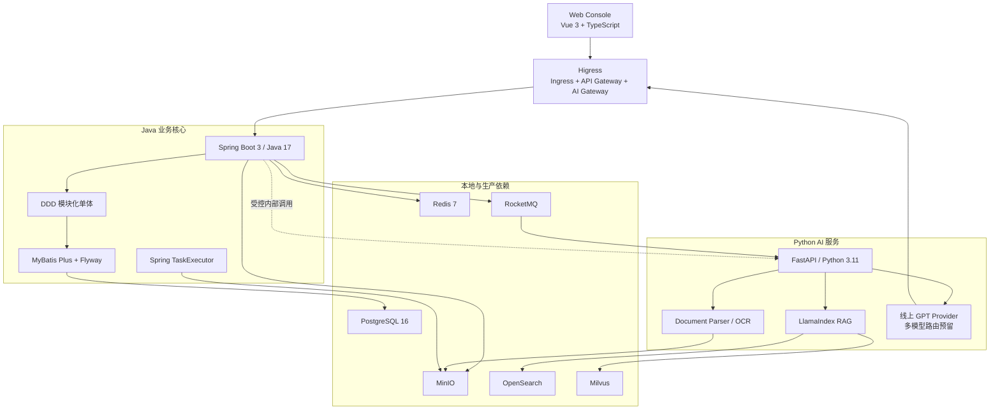

# 智能报告生成系统技术栈选型

> Skill：S6 tech_stack.selector  
> 状态：已按本项目 S6 决策重建为可读基线。  
> 约束：技能本身保持通用；本文件只描述当前项目的实际选型。

## 1. 技术栈总览

| 层级 | 当前项目选型 | 用途 |
| --- | --- | --- |
| 前端 | Vue 3 + TypeScript | 工作台、报告生成、知识库、规则、权限协作、审计页面 |
| UI 与状态 | Element Plus、Vue Router、Pinia、TanStack Query for Vue、Axios | 企业后台控件、路由、客户端状态、服务端状态和 API 调用 |
| Java 后端 | Java 17 + Spring Boot 3 | 业务 API、DDD 模块化单体、RBAC、审计、事务 |
| Java 持久化 | MyBatis Plus + Flyway | PostgreSQL 访问与数据库迁移 |
| AI 服务 | Python 3.11 + FastAPI | 文档解析、RAG、Embedding、引用评分、模型编排 |
| RAG | LlamaIndex | 知识库检索增强、引用来源和上下文构造 |
| 文档解析 | Unstructured、PyMuPDF、python-docx、openpyxl、PaddleOCR | PDF、Word、Excel、CSV、TXT、扫描件和图片表格处理 |
| 网关 | Higress | 入口网关、微服务网关、AI Gateway、安全、限流、可观测 |
| 主数据 | PostgreSQL 16 | 业务数据、审计、配置、任务、版本 |
| 缓存 | Redis 7 | 会话、短期状态、热点数据 |
| 消息队列 | RocketMQ | 报告生成、文档解析、导出、数据源同步异步任务 |
| 对象存储 | MinIO | 上传原文、解析产物、导出文件、企业模板 |
| 全文检索 | OpenSearch | 关键词检索、过滤、知识库查询 |
| 向量检索 | Milvus | Embedding 向量召回和语义检索 |
| 可观测 | OpenTelemetry、Prometheus、Grafana、Loki | 指标、日志、链路追踪、模型调用审计 |
| 本地部署 | Docker Compose | 本地依赖复用和最小资源联调 |

## 2. 技术栈架构图

## 3. 服务边界

| 服务/模块 | 技术栈 | 通信方式 | 边界 |
| --- | --- | --- | --- |
| `web-console` | Vue 3 + TypeScript | HTTPS/SSE -> Higress | 所有用户侧页面 |
| `java-report-core` | Spring Boot 3 + MyBatis Plus | REST、RocketMQ、JDBC、S3 | 报告、知识库、规则、权限、协作、审计业务核心 |
| `python-ai-service` | FastAPI + LlamaIndex | RocketMQ、内部 REST、SDK | 文档解析、RAG、Embedding、模型适配、引用评分 |
| `higress` | Higress all-in-one / K8s Gateway | HTTPS、Gateway API | 统一入口、AI Gateway、WAF、限流、观测 |
| `postgres` | PostgreSQL 16 | JDBC | 主数据和审计 |
| `rocketmq` | RocketMQ | MQ protocol | 异步任务和事件 |
| `minio` | MinIO | S3 API | 文件对象 |
| `opensearch` | OpenSearch | HTTP | 全文检索 |
| `milvus` | Milvus | SDK/gRPC | 向量检索 |

## 4. 本地开发环境

- 本地优先复用 Docker 中已有依赖；缺失时才按最小资源补充容器。
- 本地禁止连接生产数据库。
- 本地 profile 使用 `application-dev.yml`，生产 profile 使用 `application-prod.yml`。
- 当前 Docker 已运行 PostgreSQL、Redis、RocketMQ、MinIO、Milvus、OpenSearch、Higress，状态见 `local_gateway_search_status.md` 与 `upload_infrastructure_status.md`。

## 5. OpenSpec 映射

| Capability | 技术承载 |
| --- | --- |
| `report-generation` | Spring Boot、RocketMQ、FastAPI、LlamaIndex、Higress AI Gateway、SSE |
| `report-citation-export-version` | Spring Boot、PostgreSQL、MinIO、Spring TaskExecutor、Python 引用评分 |
| `knowledge-base-ingestion` | Spring Boot、FastAPI、Unstructured、PaddleOCR、OpenSearch、Milvus、MinIO、RocketMQ |
| `rule-engine` | Vue 3、规则画布组件、Spring Boot、PostgreSQL |
| `permission-collaboration` | Spring Security/RBAC、PostgreSQL、Redis、Higress |
| `audit-history-dashboard` | Spring Boot、PostgreSQL、OpenTelemetry、Prometheus、Grafana、Loki |
| `scope-guardrails` | Docker Compose 本地交付；Kubernetes/Helm 仅保留生产演进空间 |
